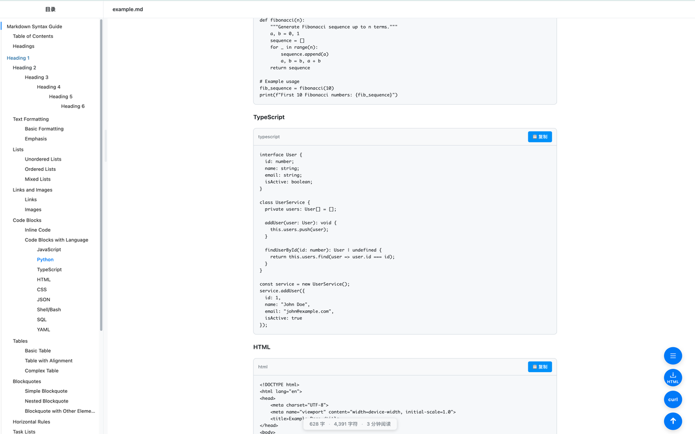

# MD Viewer Pro

一个轻量、好看的 Markdown 预览插件：支持 `file://` 自动预览、文件树管理、目录导航、代码高亮与 HTML 导出。

## 功能亮点

- 🚀 **自动预览**：打开本地 Markdown 文件时自动切换为美观预览
- 📁 **文件树管理**：可添加多个文件，左侧树形列表快速切换
- 📑 **目录导航**：自动生成目录并支持跳转/折叠
- 💻 **代码高亮**：识别代码块并提供一键复制
- 📤 **HTML 导出**：导出为独立 HTML（保留样式与交互）

## 截图



## 安装

### Chrome Web Store

[](https://chromewebstore.google.com/detail/ujson-json-formatter-view/gldjnpeaodkapkmkoljmaholndeogemk)

👉 [Install from Chrome Web Store](https://chromewebstore.google.com/detail/ujson-json-formatter-view/gldjnpeaodkapkmkoljmaholndeogemk)

### 手动安装

1. 构建项目：`npm run build`
2. 打开 Chrome/Edge：`chrome://extensions/` 或 `edge://extensions/`
3. 开启「开发者模式」
4. 点击「加载已解压的扩展程序」
5. 选择项目中的 `dist` 目录（不是项目根目录）

## 使用方法

### 自动预览（推荐）

1. 在浏览器中直接打开本地 Markdown 文件（`file://`）
2. 插件会自动切换到预览界面

### 手动管理

1. 点击工具栏插件图标
2. 左侧点击「添加文件」
3. 选择一个或多个 Markdown 文件
4. 点击文件树中的文件进行预览
5. 使用右侧目录快速跳转
6. 点击代码块上的「复制」按钮复制代码
7. 右上角按钮导出 HTML

## 开发

### 环境准备

```bash
npm install
```

### 开发模式

```bash
npm run dev
```

### 生产构建

```bash
npm run build
```

构建产物输出到 `dist/`。

## 项目结构

```
md-viewer-pro/
├── src/
│   ├── components/          # Vue 组件
│   │   ├── FileTree.vue
│   │   ├── MarkdownContent.vue
│   │   └── TableOfContents.vue
│   ├── composables/         # 组合式逻辑
│   │   ├── useFileManager.js
│   │   └── useExport.js
│   ├── styles/              # 主题与样式
│   ├── App.vue              # 主应用组件
│   └── main.js              # 应用入口
├── icons/                   # 插件图标
├── dist/                    # 构建输出（本地生成）
├── viewer.html              # 预览入口
├── manifest.json            # 扩展配置
├── vite.config.js           # Vite 配置
└── README.md
```

## 隐私

本插件不收集用户数据，详情见 `PRIVACY_POLICY.md`。

## License

MIT License，见 `LICENSE`。

## Contributing

欢迎提交 Issue 或 PR，详见 `CONTRIBUTING.md`。

## 反馈

如有建议或问题，请在 GitHub Issues 中反馈。
